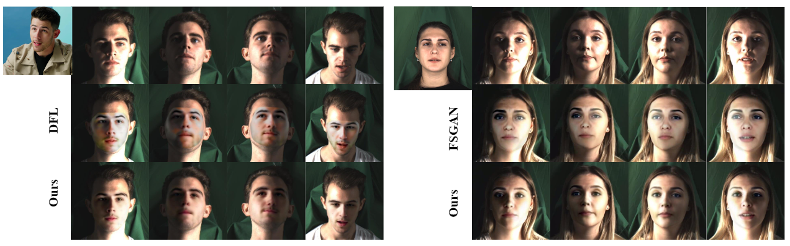
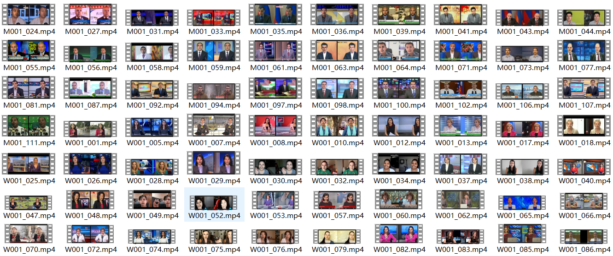
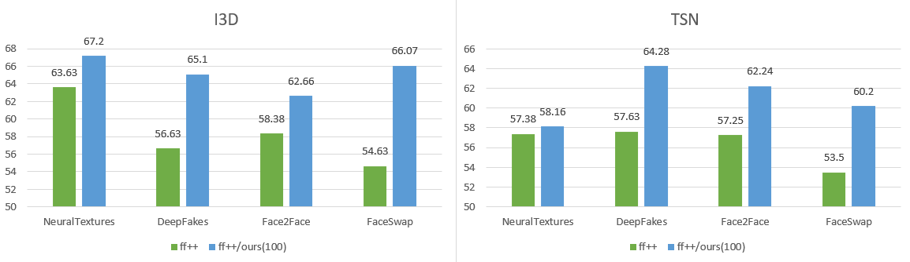

## AOT: Appearance Optimal Transport Model for Face Swapping

[Hao Zhu](https://www.zhuhaozh.xyz)1,2, [Chaoyou Fu](https://scholar.google.com/citations?user=4A1xYQwAAAAJ&hl=en)2, [Qianyi Wu](https://qianyiwu.github.io)3, [Wayne Wu](https://wywu.github.io)3, [Chen Qian](https://scholar.google.com/citations?user=AerkT0YAAAAJ&hl=en)3, [Ran He](https://scholar.google.com/citations?user=ayrg9AUAAAAJ&hl=en)2

1Anhui University  | 2NLPR&CRIPAC, CASIA | 3SenseTime Research

[Project Page](#) | [Paper](#) | [Demo](#)

> **Abstract:** Face swapping has attracted great attention for its wide range of applications. Although recent works have made gratifying progress, their swapping results tend to be inconsistent with large appearance gaps between the source and the target images. Such appearance gaps mainly come from the large discrepancies in illuminations and skin colors, widely exist in real-world scenarios. However, due to the difficulties of modeling the complex appearance mapping, it is challenging to transfer fine-grained appearances adaptively with identical traits preservation. This paper formulates appearance mapping as an optimal transport problem and proposes an Appearance Optimal Transport model (AOT) to settle it in both latent and pixel space. Specifically, on the one hand, a relighting generator is designed to simulate the optimal transport plan. It is solved via minimizing Wasserstein distance of the learned features in the latent space, bringing better performance and less computation than the conventional optimization manner. On the other hand, in order to further refine the solution of the optimal transport plan, we develop a segmentation game to minimize the Wasserstein distance in the pixel space. A discriminator is introduced to distinguish the fake parts from a mix of real and fake image patches. Extensive experiments reveal the superiority of our method in the large appearance gaps situation, when compared with state-of-the-art methods.

## Important Note

This is a purely academic study dedicated to improving the performance of face swapping as well as the face forgery detection.
ANY RESOUCES PROVIDED HERE ARE NOT TO BE USED FOR MALICIOUS OR INAPPROPRIATE USE CASES.

## Face Forgery
The following datasets and the checkpoints of detectors can be downloaded from the [BaiduYun](https://pan.baidu.com/s/143Xuvea-ICcFuvgYfyY-Wg) (code: dzgc).

### Manipulated Dataset

We currently provide 100 manipulated videos of [FF++](#) by refining the results of [DeepFaceLab](#) and  [DeeperForensics-1.0](#) respectively. 

The more manipulated videos are coming soon. 

### Face Forgery Detection

Binary detection accuracy of two video classification baselines: [I3D](https://github.com/piergiaj/pytorch-i3d) and [TSN](https://github.com/yjxiong/tsn-pytorch) on the hidden set provided by [DeeperForensics-1.0](https://github.com/EndlessSora/DeeperForensics-1.0).
1) We trained the baselines on four manipulated datasets of [FF++](#) produced by [DeepFakes](#),  [Face2Face](#), [FaceSwap](#), and [NeuralTextures](#) **(Green bars)**. 

2) Then, we add 100 manipulated videos produced by our method to the training set. All detection accuracies are improved with the addition of our data. **(Blue bars)**. 

 

## Citation

Coming soon.  

## Acknowledgments

Coming soon. 
